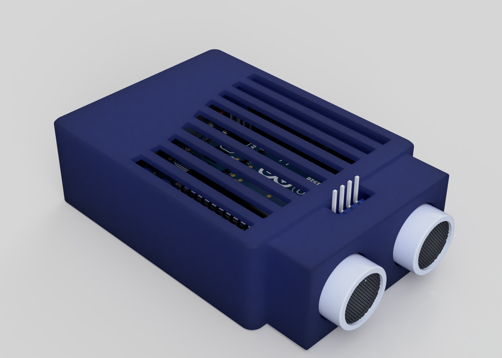
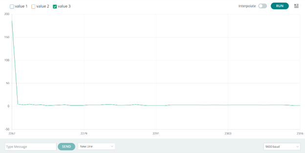
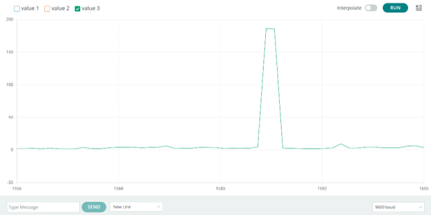
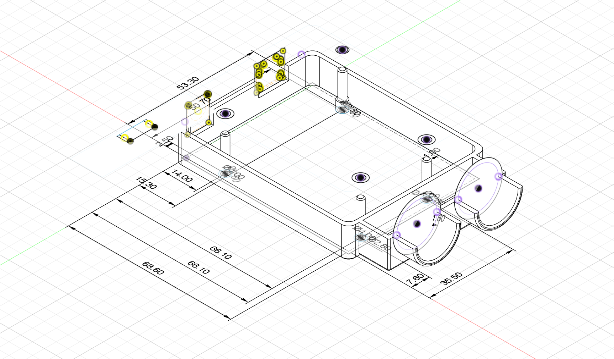
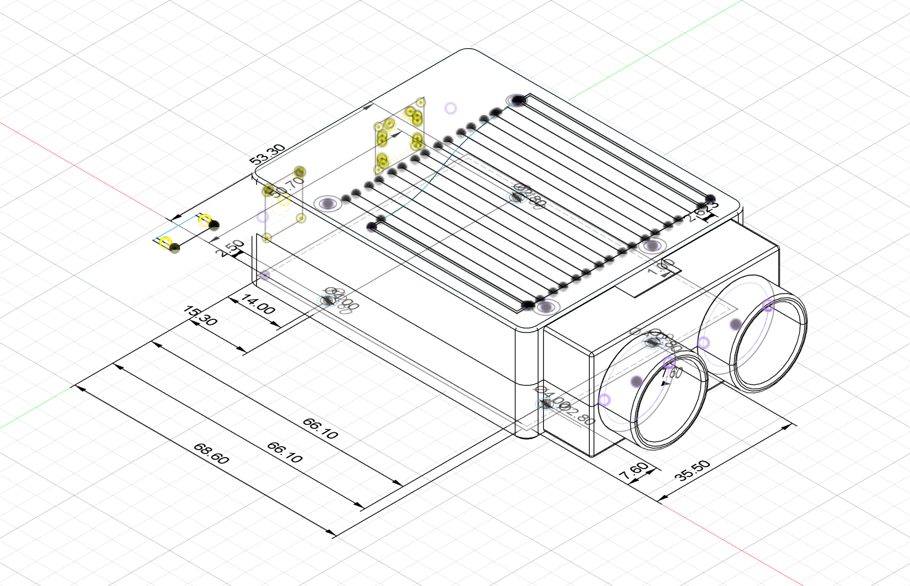
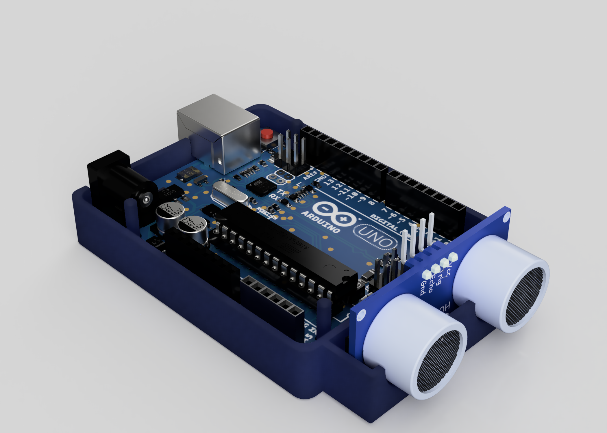
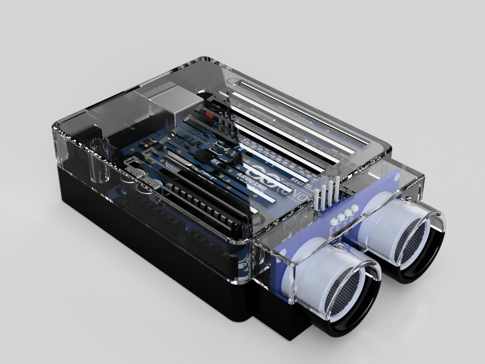

# Crack Detection Device

A low-cost ultrasonic surface-crack detector: an HC-SR04 on an Arduino
Uno inside a custom 3D-printed enclosure. Built as an accessible
alternative to commercial NDT equipment, which starts around €100 and
runs far higher for professional units.

## Why

Commercial crack detection works — ultrasonic pulse flaw detectors and
eddy current testers both do the job well — but they're priced for
professional inspection contracts, which puts them out of reach for
small projects and routine checks.

A pre-development survey of construction, manufacturing, and QA
workers alongside home-improvement users found the two most-wanted
features were **portability** and **low cost**, ahead of severity
classification and data logging. That result set the design brief:
small, simple, cheap.

The project targets UN SDG 9 (Industry, Innovation and Infrastructure).
Undetected structural cracks carry a real cost — the Rana Plaza
collapse in 2013 followed visible wall cracks that were dismissed the
day before the building came down.

## How it works

The HC-SR04 emits ultrasonic pulses and times the echo. Swept across a
surface, a crack registers as a spike in measured distance: the sound
path lengthens where the surface recedes. The Arduino IDE's serial
plotter renders this live, so a crack appears as a visible deviation
from an otherwise flat trace.

| No crack | Crack detected |
|:---:|:---:|
|  |  |

## Sensor validation

Before building anything, the sensor was checked against its datasheet
claim of ±3 mm accuracy across 2–400 cm. Testing focused on the short
end of that range, since surface crack detection never uses the rest.

| Actual (cm) | Measured (cm) | Error (cm) |
|---|---|---|
| 0.5 | 0.49 | 0.01 |
| 1.0 | 1.04 | −0.04 |
| 2.0 | 1.99 | 0.01 |
| 2.5 | 2.35 | 0.15 |
| 3.0 | 3.01 | 0.01 |
| 3.6 | 3.59 | 0.01 |
| 8.0 | 7.79 | 0.21 |

Worst case 2.1 mm, inside the datasheet's 3 mm. Worth noting the
readings at 0.5 cm and 1.0 cm sit below the sensor's rated 2 cm
minimum and shouldn't be treated as valid — the HC-SR04 has a blind
zone there where the echo returns before the receiver settles.

## Enclosure

Designed in Fusion 360 around the Arduino Uno's mounting footprint,
printed in PLA as a two-part snap-fit shell.

  
  

| Feature | Value | Reasoning |
|---|---|---|
| External | 68.6 × 53.3 × 22.0 mm | Arduino footprint plus clearance |
| Wall thickness | 1.6 mm | Exactly 4 perimeters at a 0.4 mm nozzle |
| Internal clearance | 1.0 mm | Print shrinkage and insertion tolerance |
| Mounting pins | Ø2.8 mm | Under the board's Ø3.2 mm holes — friction fit, not press fit |
| Standoffs | Ø4.0 × 4.0 mm | Keeps solder joints off the floor |
| Snap-fit overlap | 4.0 mm, chamfered | Guides pins in, prevents print damage on assembly |
| Ventilation | 9 slots, 3.5 mm | Airflow without compromising the shell |

Every dimension was chosen against a manufacturing constraint rather
than picked by eye. The 1.6 mm wall is two perimeters either side at a
0.4 mm nozzle — strong without wasting material. The pins are
deliberately undersized against the Arduino's holes so the board
friction-fits and can still be removed.

The sensor housing extends 12.6 mm from the body with the barrel
seated 9.0 mm deep, holding the transducers at fixed geometry relative
to the enclosure — important, since sweep distance is the measurement.
Cut-outs on the top expose the programming header, so the board can be
reflashed without opening the case.

## Validation with users

A post-development survey put the prototype in front of the same kinds
of users as the initial one. Feedback was positive on ease of use and
build quality, with two recurring requests: **data storage** across
repeated checks on one area, and **more detailed output** for
reporting.

Both had ranked below portability and cost in the pre-development
survey. They only surfaced as priorities once people had something in
their hands — which is the case for building the prototype at all
rather than designing from the first survey and stopping.

## What I'd change

- **The device detects surface geometry, not cracks.** A step, a seam,
  or a texture change produces the same spike as a fracture. Nothing
  distinguishes them, which limits it to guided use on surfaces the
  operator already knows should be flat.
- **No severity classification**, despite it ranking third in user
  demand. Depth and width determine whether a crack matters, and a
  single-point distance reading gives neither.
- **Sub-2 cm readings are outside the sensor's rated range** and were
  included in the accuracy table anyway. They shouldn't have been.
- **Detection is by eye, off a plotter.** No thresholding, no logging,
  no output beyond a live graph — precisely the two things users asked
  for after handling the prototype.

## Hardware
Arduino Uno · HC-SR04 ultrasonic sensor · 3D-printed PLA enclosure

## Files
- `src/crack_detector.cpp` — sensor firmware
- `cad/` — printable enclosure, two parts (snap-fit)
- `docs/technical-report.pdf` — research, testing, design, survey data
- `docs/problem-specification.pdf` — original project brief
- [`media/enclosure-render.mp4`](media/enclosure-render.mp4) — enclosure render
- [`media/presentation-recording.mp4`](media/presentation-recording.mp4) — group presentation
- `images/` — renders, dimensioned drawings, serial plots

---

EE397 Project-Based Learning, Maynooth University, Year 3 Semester 1
(Dec 2025). Group of 3 — my contribution: enclosure design (Fusion 360
modelling, dimensioning, print preparation), firmware, and research.
Full team credited in the report.
